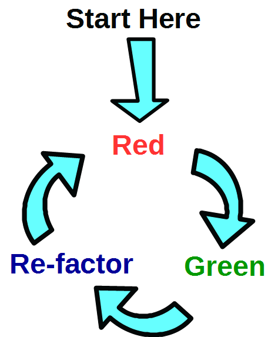

# Test Driven Development
## Unit testing
- Testing of units of code, i.e. testing only part/section of the code
- Written by the developer to validate the their code


### Unit testing in Python
The _doctest_ approach:
```python
def add_stuff(self, n, m):
    """ Pointless function that adds two numbers
    
    >>> add_stuff(3, 5)
    8
    """
    return n + m

```

To execute the test form the command line:
```
 python -m doctest -v myfunctions.py
```
Or you can run doctests in PyCharm

The _unittest_ apporach
```python
import unittest
import myfunctions

class SomeTest(unittest.TestCase):

    def test_it_adds(self):
        self.assertEqual(myfunctions.add_stuff(4, 7), 11)

```

To execute the test form the command line for a single file:
``` 
 python -m unittest some_tests.py
```

To execute the test form the command line for a directory/module :
``` 
 python -m unittest <directory>
```


Or you can run unittests in PyCharm


## Developing following TDD

### The Cycle
- Red - Write a single test and ensure it fails
- Green - Make the test pass
- Refactor - refactor the code and rerun the test
Repeat above 



### The Ground rules
1. Write one test a time and follow the cycle
2. Assume the code exists
3. Let the IDE do the work
4. Write only the code required to pass the test

## Demonstration
Leap year function

## Exercise
Write a function that can take a String containing Roman numerals and return a the equivalent number. 