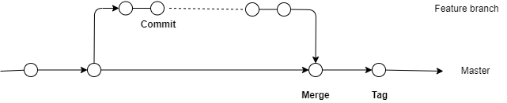

# CI/CD: Concrete Examples

Concrete examples from e-therapeutics software development projects

## Development workflow

Development workflow and CI/CD are intimately related.

\newpage

## CI/CD pipeline: Java package

Java package to be included and used by other applications. Concepts are not Java specific.

* Build
  * Compile code
* Test
  * Run automated tests
  * CI/CD categorization of tests; fast vs slow
* Code analysis
  * Lint or code formatting
  * Static code analysis
  * Is the code clean?
  * Does the code possess recognizable bug, security, performance, etc patterns?
* Package
  * builds release artefacts - in this case the jar files for code, source code, and documentation
  * pushes release artefacts to artefact repository - our internal Nexus server
* Release pipeline (from Git tag) repeats everything in master pipeline - not ideal
  * mainly a limitation of the Java build tools which aren't very CD friendly 

\newpage

## CI/CD pipeline: Service

Executable application providing a REST API. 

* Release artefact is a Docker file.

* First three, same as with Java package
* Package
  * builds release artefacts - Docker image
  * pushes release artefacts to artefact repository - Docker registry
* Image analysis
  * analysis of Docker image for known issues (generally security vulnerabilities)
* Release
  * tags last built Docker image with semantic tag
* Potential extensions of master pipeline
  * Test ability to deploy the produced Docker image
  * Once deployed, test the running application
  * Non-functional tests (load testing, reliability, etc)
    * Chaos engineering - randomly perturb (production) system to improve resilience (e.g. Netflix chaos monkey) 

\newpage

## CI/CD pipeline: Failure

\newpage