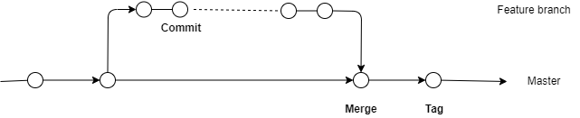

# CI/CD: Concrete Examples

Concrete examples from e-therapeutics software development projects

## Development workflow

Development workflow and CI/CD are intimately related.

* Development is performed off master on what are sometimes called feature branches
* Master is intended to be always releasable - key CD goal
* CI/CD Triggers:
  * Commit/push to non-master branches - CI build
  * Commit/push to master (via merge from branch) - CD build
  * Addition of Git tag to master - Release build

\newpage
