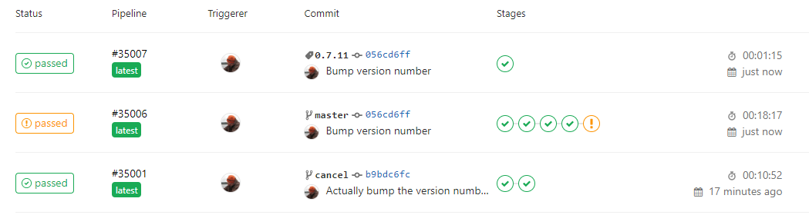
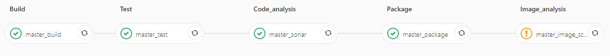

# CI/CD: Concrete Examples

## CI/CD pipeline: Service

Executable application providing a REST API. 

* Release artefact is a Docker file.

* First three, same as with Java package
* Package
  * builds release artefacts - Docker image
  * pushes release artefacts to artefact repository - Docker registry
* Image analysis
  * analysis of Docker image for known issues (generally security vulnerabilities)
* Release
  * tags last built Docker image with semantic tag
* Potential extensions of master pipeline
  * Test ability to deploy the produced Docker image
  * Once deployed, test the running application
  * Non-functional tests (load testing, reliability, etc)
    * Chaos engineering - randomly perturb (production) system to improve resilience (e.g. Netflix chaos monkey) 

\newpage
